# Small Data Generative AI for Culturally Specific Artistic Creation: A Case Study on the Sonic Space of *sarīr*

ISEA 2026 Anonymous Submission

---

## 1. Results from Open-Source Text-to-Audio Models

 

<table style="border-collapse: collapse; width: 100%; text-align: center;">
  <tr style="border-bottom: 2px solid #ccc;">
    <th>AudioLDM2</th>
    <th>Stable Audio Open</th>
    <th>AudioGen</th>
  </tr>

  <!-- Prompt 1 -->
  <tr style="border-bottom: 1px solid #ddd;">
    <td colspan="3"><em>prompt: "Arabic calligraphy sarir."</em></td>
  </tr>

  <!-- Example 1 -->
  <tr style="border-bottom: 1px solid #ddd;">
    <td><audio src="resources/text-to-audio/audioldm-2/gen_seed42/Arabic calligraphy sarir..wav" controls></audio></td>
    <td><audio src="resources/text-to-audio/stable-audio-open/audio_5_Arabic_calligraphy_sarir__seed123050232.wav" controls></audio></td>
    <td><audio src="resources/text-to-audio/audiogen/gen_Arabic-calligraphy-sarir._seed20499904.wav" controls></audio></td>
  </tr>

  <!-- Example 2 -->
  <tr style="border-bottom: 1px solid #ddd;">
    <td><audio src="resources/text-to-audio/audioldm-2/gen_seed888/Arabic calligraphy sarir..wav" controls></audio></td>
    <td><audio src="resources/text-to-audio/stable-audio-open/audio_5_Arabic_calligraphy_sarir__seed1000229253.wav" controls></audio></td>
    <td><audio src="resources/text-to-audio/audiogen/gen_Arabic-calligraphy-sarir._seed1222438363.wav" controls></audio></td>
  </tr>

  <!-- Example 3 -->
  <tr style="border-bottom: 1px solid #ddd;">
    <td><audio src="resources/text-to-audio/audioldm-2/gen_seed1337/Arabic calligraphy sarir..wav" controls></audio></td>
    <td><audio src="resources/text-to-audio/stable-audio-open/audio_5_Arabic_calligraphy_sarir__seed1050737826.wav" controls></audio></td>
    <td><audio src="resources/text-to-audio/audiogen/gen_Arabic-calligraphy-sarir._seed1434336054.wav" controls></audio></td>
  </tr>

  <!-- Prompt 2 -->
  <tr style="border-bottom: 1px solid #ddd;">
    <td colspan="3"><em>prompt: "Persian calligraphy sarir."</em></td>
  </tr>
  
  <!-- Example 1 -->
  <tr style="border-bottom: 1px solid #ddd;">
    <td><audio src="resources/text-to-audio/audioldm-2/gen_seed42/Persian calligraphy sarir..wav" controls></audio></td>
    <td><audio src="resources/text-to-audio/stable-audio-open/audio_6_Persian_calligraphy_sarir__seed123050232.wav" controls></audio></td>
    <td><audio src="resources/text-to-audio/audiogen/gen_Persian-calligraphy-sarir._seed20499904.wav" controls></audio></td>
  </tr>

  <!-- Example 2 -->
  <tr style="border-bottom: 1px solid #ddd;">
    <td><audio src="resources/text-to-audio/audioldm-2/gen_seed888/Persian calligraphy sarir..wav" controls></audio></td>
    <td><audio src="resources/text-to-audio/stable-audio-open/audio_6_Persian_calligraphy_sarir__seed1000229253.wav" controls></audio></td>
    <td><audio src="resources/text-to-audio/audiogen/gen_Persian-calligraphy-sarir._seed1222438363.wav" controls></audio></td>
  </tr>

  <!-- Example 3 -->
  <tr style="border-bottom: 1px solid #ddd;">
    <td><audio src="resources/text-to-audio/audioldm-2/gen_seed1337/Persian calligraphy sarir..wav" controls></audio></td>
    <td><audio src="resources/text-to-audio/stable-audio-open/audio_6_Persian_calligraphy_sarir__seed1050737826.wav" controls></audio></td>
    <td><audio src="resources/text-to-audio/audiogen/gen_Persian-calligraphy-sarir._seed1676947703.wav" controls></audio></td>
  </tr>

  <!-- Prompt 3 -->
  <tr style="border-bottom: 1px solid #ddd;">
    <td colspan="3"><em>prompt: "The creaking sound of a reed pen during Arabic calligraphy writing."</em></td>
  </tr>
  
  <!-- Example 1 -->
  <tr style="border-bottom: 1px solid #ddd;">
    <td><audio src="resources/text-to-audio/audioldm-2/gen_seed42/The creaking sound of a reed pen during Arabic calligraphy writing..wav" controls></audio></td>
    <td><audio src="resources/text-to-audio/stable-audio-open/audio_3_The_creaking_sound_of_a_reed_pen_during_Arabic_calligraphy_writing__seed123050232.wav" controls></audio></td>
    <td><audio src="resources/text-to-audio/audiogen/gen_The-creaking-sound-of-a-reed-pen-during-Arabic-calligraphy-writing._seed20499904.wav" controls></audio></td>
  </tr>

  <!-- Example 2 -->
  <tr style="border-bottom: 1px solid #ddd;">
    <td><audio src="resources/text-to-audio/audioldm-2/gen_seed888/The creaking sound of a reed pen during Arabic calligraphy writing..wav" controls></audio></td>
    <td><audio src="resources/text-to-audio/stable-audio-open/audio_3_The_creaking_sound_of_a_reed_pen_during_Arabic_calligraphy_writing__seed1686759985.wav" controls></audio></td>
    <td><audio src="resources/text-to-audio/audiogen/gen_The-creaking-sound-of-a-reed-pen-during-Arabic-calligraphy-writing._seed1222438363.wav" controls></audio></td>
  </tr>

  <!-- Example 3 -->
  <tr style="border-bottom: 1px solid #ddd;">
    <td><audio src="resources/text-to-audio/audioldm-2/gen_seed1337/The creaking sound of a reed pen during Arabic calligraphy writing..wav" controls></audio></td>
    <td><audio src="resources/text-to-audio/stable-audio-open/audio_3_The_creaking_sound_of_a_reed_pen_during_Arabic_calligraphy_writing__seed1050737826.wav" controls></audio></td>
    <td><audio src="resources/text-to-audio/audiogen/gen_The-creaking-sound-of-a-reed-pen-during-Arabic-calligraphy-writing._seed1434336054.wav" controls></audio></td>
  </tr>

  <!-- Prompt 4 -->
  <tr style="border-bottom: 1px solid #ddd;">
    <td colspan="3"><em>prompt: "The creaking sound of a reed pen during Persian calligraphy writing."</em></td>
  </tr>
  
  <!-- Example 1 -->
  <tr style="border-bottom: 1px solid #ddd;">
    <td><audio src="resources/text-to-audio/audioldm-2/gen_seed42/The creaking sound of a reed pen during Persian calligraphy writing..wav" controls></audio></td>
    <td><audio src="resources/text-to-audio/stable-audio-open/audio_4_The_creaking_sound_of_a_reed_pen_during_Persian_calligraphy_writing__seed123050232.wav" controls></audio></td>
    <td><audio src="resources/text-to-audio/audiogen/gen_The-creaking-sound-of-a-reed-pen-during-Persian-calligraphy-writing._seed20499904.wav" controls></audio></td>
  </tr>

  <!-- Example 2 -->
  <tr style="border-bottom: 1px solid #ddd;">
    <td><audio src="resources/text-to-audio/audioldm-2/gen_seed888/The creaking sound of a reed pen during Persian calligraphy writing..wav" controls></audio></td>
    <td><audio src="resources/text-to-audio/stable-audio-open/audio_4_The_creaking_sound_of_a_reed_pen_during_Persian_calligraphy_writing__seed1000229253.wav" controls></audio></td>
    <td><audio src="resources/text-to-audio/audiogen/gen_The-creaking-sound-of-a-reed-pen-during-Persian-calligraphy-writing._seed1222438363.wav" controls></audio></td>
  </tr>

  <!-- Example 3 -->
  <tr style="border-bottom: 1px solid #ddd;">
    <td><audio src="resources/text-to-audio/audioldm-2/gen_seed1337/The creaking sound of a reed pen during Persian calligraphy writing..wav" controls></audio></td>
    <td><audio src="resources/text-to-audio/stable-audio-open/audio_4_The_creaking_sound_of_a_reed_pen_during_Persian_calligraphy_writing__seed1753377662.wav" controls></audio></td>
    <td><audio src="resources/text-to-audio/audiogen/gen_The-creaking-sound-of-a-reed-pen-during-Persian-calligraphy-writing._seed1434336054.wav" controls></audio></td>
  </tr>

  <!-- Prompt 5 -->
  <tr style="border-bottom: 1px solid #ddd;">
    <td colspan="3"><em>prompt: "The sound of a reed pen writing in Arabic calligraphy."</em></td>
  </tr>
  
  <!-- Example 1 -->
  <tr style="border-bottom: 1px solid #ddd;">
    <td><audio src="resources/text-to-audio/audioldm-2/gen_seed42/The sound of a reed pen writing in Arabic calligraphy..wav" controls></audio></td>
    <td><audio src="resources/text-to-audio/stable-audio-open/audio_1_The_sound_of_a_reed_pen_writing_in_Arabic_calligraphy__seed1686759985.wav" controls></audio></td>
    <td><audio src="resources/text-to-audio/audiogen/gen_The-sound-of-a-reed-pen-writing-in-Arabic-calligraphy._seed20499904.wav" controls></audio></td>
  </tr>

  <!-- Example 2 -->
  <tr style="border-bottom: 1px solid #ddd;">
    <td><audio src="resources/text-to-audio/audioldm-2/gen_seed888/The sound of a reed pen writing in Arabic calligraphy..wav" controls></audio></td>
    <td><audio src="resources/text-to-audio/stable-audio-open/audio_1_The_sound_of_a_reed_pen_writing_in_Arabic_calligraphy__seed1753377662.wav" controls></audio></td>
    <td><audio src="resources/text-to-audio/audiogen/gen_The-sound-of-a-reed-pen-writing-in-Arabic-calligraphy._seed1222438363.wav" controls></audio></td>
  </tr>

  <!-- Example 3 -->
  <tr style="border-bottom: 1px solid #ddd;">
    <td><audio src="resources/text-to-audio/audioldm-2/gen_seed1337/The sound of a reed pen writing in Arabic calligraphy..wav" controls></audio></td>
    <td><audio src="resources/text-to-audio/stable-audio-open/audio_1_The_sound_of_a_reed_pen_writing_in_Arabic_calligraphy__seed1050737826.wav" controls></audio></td>
    <td><audio src="resources/text-to-audio/audiogen/gen_The-sound-of-a-reed-pen-writing-in-Arabic-calligraphy._seed1434336054.wav" controls></audio></td>
  </tr>

  <!-- Prompt 6 -->
  <tr style="border-bottom: 1px solid #ddd;">
    <td colspan="3"><em>prompt: "The sound of a reed pen writing in Persian calligraphy."</em></td>
  </tr>
  
  <!-- Example 1 -->
  <tr style="border-bottom: 1px solid #ddd;">
    <td><audio src="resources/text-to-audio/audioldm-2/gen_seed42/The sound of a reed pen writing in Persian calligraphy..wav" controls></audio></td>
    <td><audio src="resources/text-to-audio/stable-audio-open/audio_2_The_sound_of_a_reed_pen_writing_in_Persian_calligraphy__seed123050232.wav" controls></audio></td>
    <td><audio src="resources/text-to-audio/audiogen/gen_The-sound-of-a-reed-pen-writing-in-Persian-calligraphy._seed20499904.wav" controls></audio></td>
  </tr>

  <!-- Example 2 -->
  <tr style="border-bottom: 1px solid #ddd;">
    <td><audio src="resources/text-to-audio/audioldm-2/gen_seed888/The sound of a reed pen writing in Persian calligraphy..wav" controls></audio></td>
    <td><audio src="resources/text-to-audio/stable-audio-open/audio_2_The_sound_of_a_reed_pen_writing_in_Persian_calligraphy__seed1000229253.wav" controls></audio></td>
    <td><audio src="resources/text-to-audio/audiogen/gen_The-sound-of-a-reed-pen-writing-in-Persian-calligraphy._seed1222438363.wav" controls></audio></td>
  </tr>

  <!-- Example 3 -->
  <tr style="border-bottom: 1px solid #ddd;">
    <td><audio src="resources/text-to-audio/audioldm-2/gen_seed1337/The sound of a reed pen writing in Persian calligraphy..wav" controls></audio></td>
    <td><audio src="resources/text-to-audio/stable-audio-open/audio_2_The_sound_of_a_reed_pen_writing_in_Persian_calligraphy__seed1050737826.wav" controls></audio></td>
    <td><audio src="resources/text-to-audio/audiogen/gen_The-sound-of-a-reed-pen-writing-in-Persian-calligraphy._seed1434336054.wav" controls></audio></td>
  </tr>

  <!-- Prompt 7 -->
  <tr style="border-bottom: 1px solid #ddd;">
    <td colspan="3">prompt: "صدای قلم نی هنگام خوشنویسی"</td>
  </tr>
  
  <!-- Example 1 -->
  <tr style="border-bottom: 1px solid #ddd;">
    <td><audio src="resources/text-to-audio/audioldm-2/صدای قلم نی هنگام خوشنویسی_seed888.wav" controls></audio></td>
    <td><audio src="resources/text-to-audio/stable-audio-open/audio_10_صدای_قلم_نی_هنگام_خوشنویسی_seed1122933498_10s.wav" controls></audio></td>
    <td><audio src="resources/text-to-audio/audiogen/gen_صدای-قلم-نی-هنگام-خوشنویسی_seed63382764.wav" controls></audio></td>
  </tr>

  <!-- Example 2 -->
  <tr style="border-bottom: 1px solid #ddd;">
    <td><audio src="resources/text-to-audio/audioldm-2/صدای قلم نی هنگام خوشنویسی_seed1337.wav" controls></audio></td>
    <td><audio src="resources/text-to-audio/stable-audio-open/audio_10_صدای_قلم_نی_هنگام_خوشنویسی_seed1147205943_10s.wav" controls></audio></td>
    <td><audio src="resources/text-to-audio/audiogen/gen_صدای-قلم-نی-هنگام-خوشنویسی_seed999058475.wav" controls></audio></td>
  </tr>

  <!-- Example 3 -->
  <tr style="border-bottom: 1px solid #ddd;">
    <td><audio src="resources/text-to-audio/audioldm-2/صدای قلم نی هنگام خوشنویسی_seed132234.wav" controls></audio></td>
    <td><audio src="resources/text-to-audio/stable-audio-open/audio_10_صدای_قلم_نی_هنگام_خوشنویسی_seed1483926819_10s.wav" controls></audio></td>
    <td><audio src="resources/text-to-audio/audiogen/gen_صدای-قلم-نی-هنگام-خوشنویسی_seed1909618708.wav" controls></audio></td>
  </tr>

</table>

---

## 2. Audio and Spectrogram Samples from the *sarīr* Dataset

  

    <strong>Example 1</strong>
    <audio src="resources/audios/r1-1-136.wav" controls></audio>
    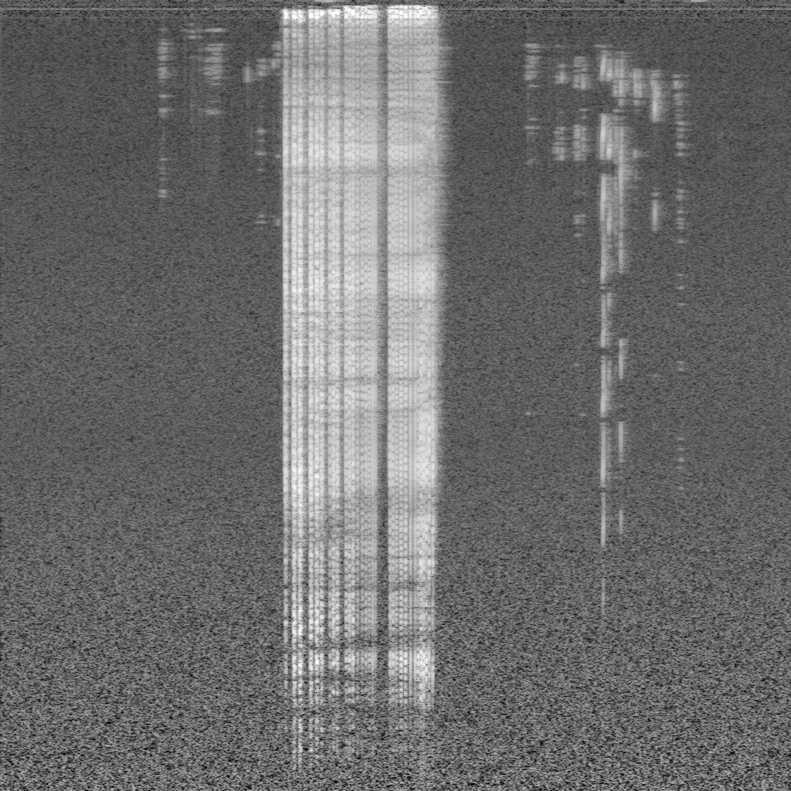
  

  

    <strong>Example 2</strong>
    <audio src="resources/audios/r2-1-23.wav" controls></audio>
    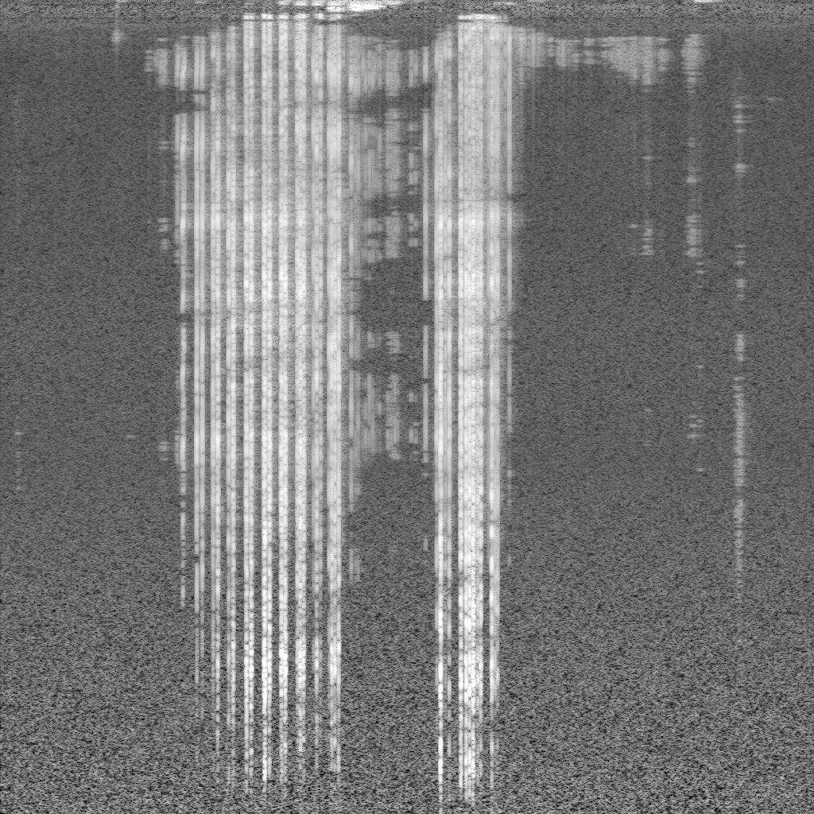
  

  

    <strong>Example 3</strong>
    <audio src="resources/audios/r2-1-142.wav" controls></audio>
    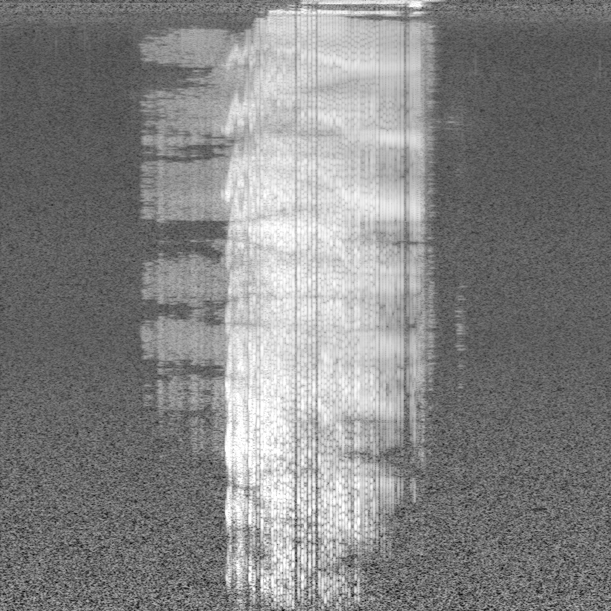
  

  

    <strong>Example 4</strong>
    <audio src="resources/audios/r3-1-82.wav" controls></audio>
    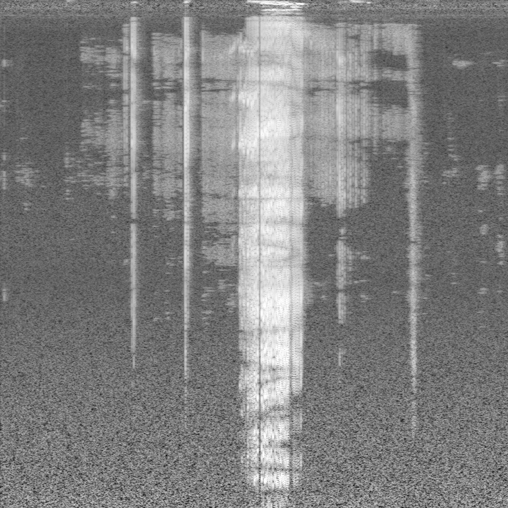
  

  

    <strong>Example 5</strong>
    <audio src="resources/audios/r5-1-312.wav" controls></audio>
    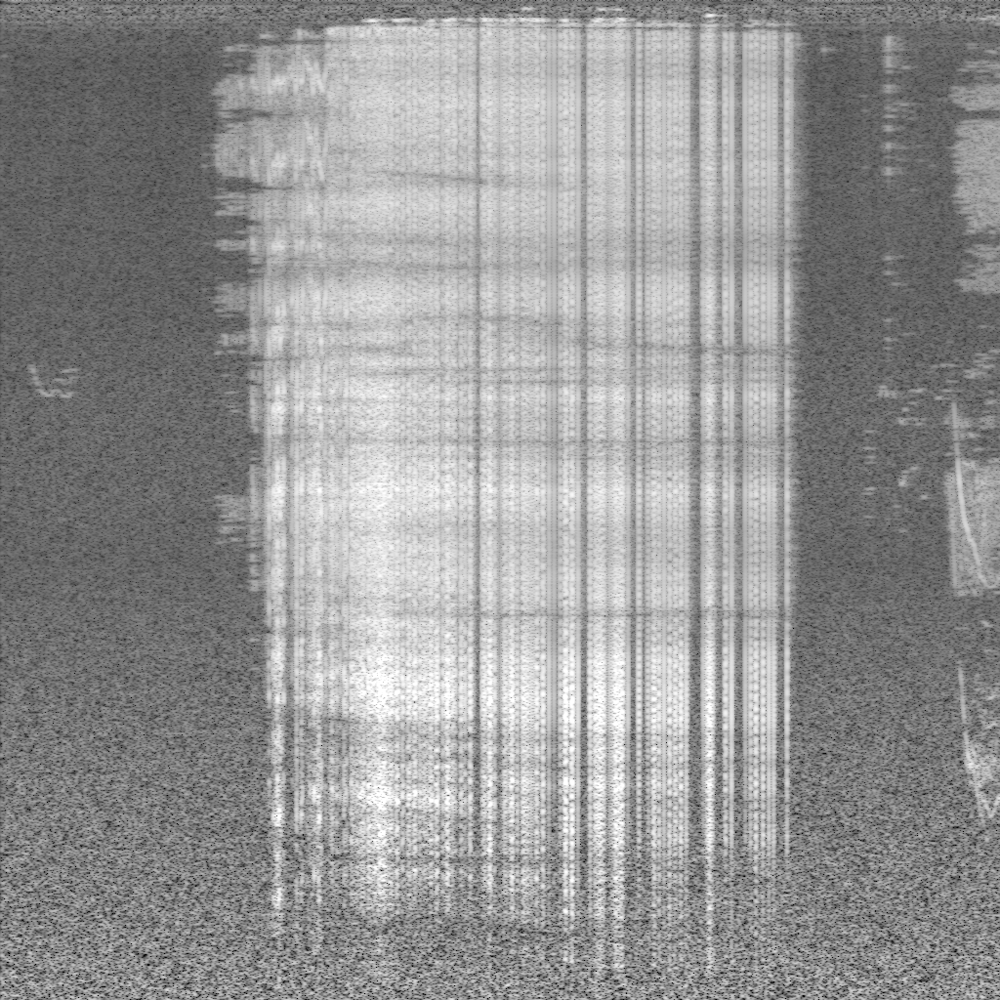
  

  

    <strong>Example 6</strong>
    <audio src="resources/audios/r4-1-152.wav" controls></audio>
    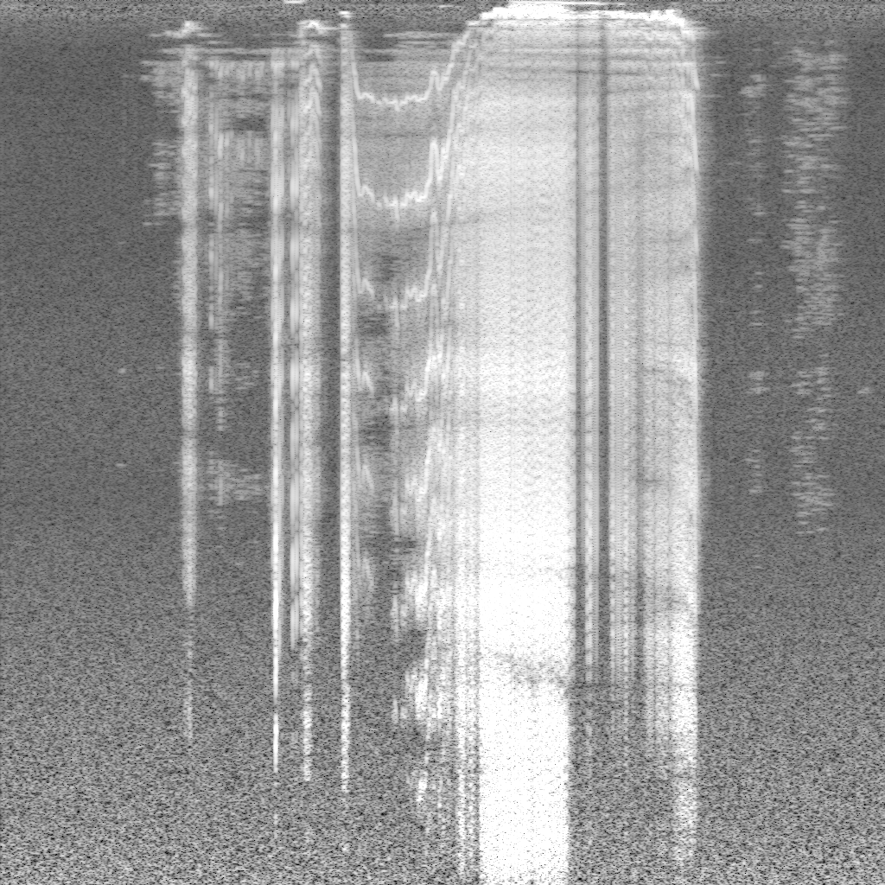
  

---

## 3. Results from RAVE Model Training

### 3.1 Generated Samples from RAVE v2 Configuration+Prior (our preferred results)

  

    <strong>Example 1</strong>
    <audio src="resources/rave/v2-prior-1.wav" controls></audio>
  

  

    <strong>Example 2</strong>
    <audio src="resources/rave/v2-prior-2.wav" controls></audio>
  

  

    <strong>Example 3</strong>
    <audio src="resources/rave/v2-prior-3.wav" controls></audio>
  

  

    <strong>Example 4</strong>
    <audio src="resources/rave/v2-prior-4.wav" controls></audio>
  

  

    <strong>Example 5</strong>
    <audio src="resources/rave/v2-prior-5.wav" controls></audio>
  

  

    <strong>Example 6</strong>
    <audio src="resources/rave/v2-prior-6.wav" controls></audio>
  

---

### 3.2 Generated Samples from RAVE v2 Configuration

  

    <strong>Example 1</strong>
    <audio src="resources/rave/v2-1.wav" controls></audio>
  

  

    <strong>Example 2</strong>
    <audio src="resources/rave/v2-2.wav" controls></audio>
  

  

    <strong>Example 3</strong>
    <audio src="resources/rave/v2-3.wav" controls></audio>
  

  

    <strong>Example 4</strong>
    <audio src="resources/rave/v2-4.wav" controls></audio>
  

  

    <strong>Example 5</strong>
    <audio src="resources/rave/v2-5.wav" controls></audio>
  

  

    <strong>Example 6</strong>
    <audio src="resources/rave/v2-6.wav" controls></audio>
  

---

### 3.3 Generated Samples from RAVE v2-small Configuration

  

    <strong>Example 1</strong>
    <audio src="resources/rave/v2-small-1.wav" controls></audio>
  

  

    <strong>Example 2</strong>
    <audio src="resources/rave/v2-small-2.wav" controls></audio>
  

  

    <strong>Example 3</strong>
    <audio src="resources/rave/v2-small-3.wav" controls></audio>
  

  

    <strong>Example 4</strong>
    <audio src="resources/rave/v2-small-4.wav" controls></audio>
  

  

    <strong>Example 5</strong>
    <audio src="resources/rave/v2-small-5.wav" controls></audio>
  

  

    <strong>Example 6</strong>
    <audio src="resources/rave/v2-small-6.wav" controls></audio>
  

---

### 3.4 Generated Samples from RAVE v1 Configuration

  

    <strong>Example 1</strong>
    <audio src="resources/rave/v1-1.wav" controls></audio>
  

  

    <strong>Example 2</strong>
    <audio src="resources/rave/v1-2.wav" controls></audio>
  

  

    <strong>Example 3</strong>
    <audio src="resources/rave/v1-3.wav" controls></audio>
  

  

    <strong>Example 4</strong>
    <audio src="resources/rave/v1-4.wav" controls></audio>
  

  

    <strong>Example 5</strong>
    <audio src="resources/rave/v1-5.wav" controls></audio>
  

  

    <strong>Example 6</strong>
    <audio src="resources/rave/v1-6.wav" controls></audio>
  

---

## 4. Results from StyleGAN2 Model Training
### 4.1 Generated Spectrograms → Audio Reconstruction → RAVE Correction

  

    <strong>Example 1</strong>
    <em>Generated Spectrogram</em>
    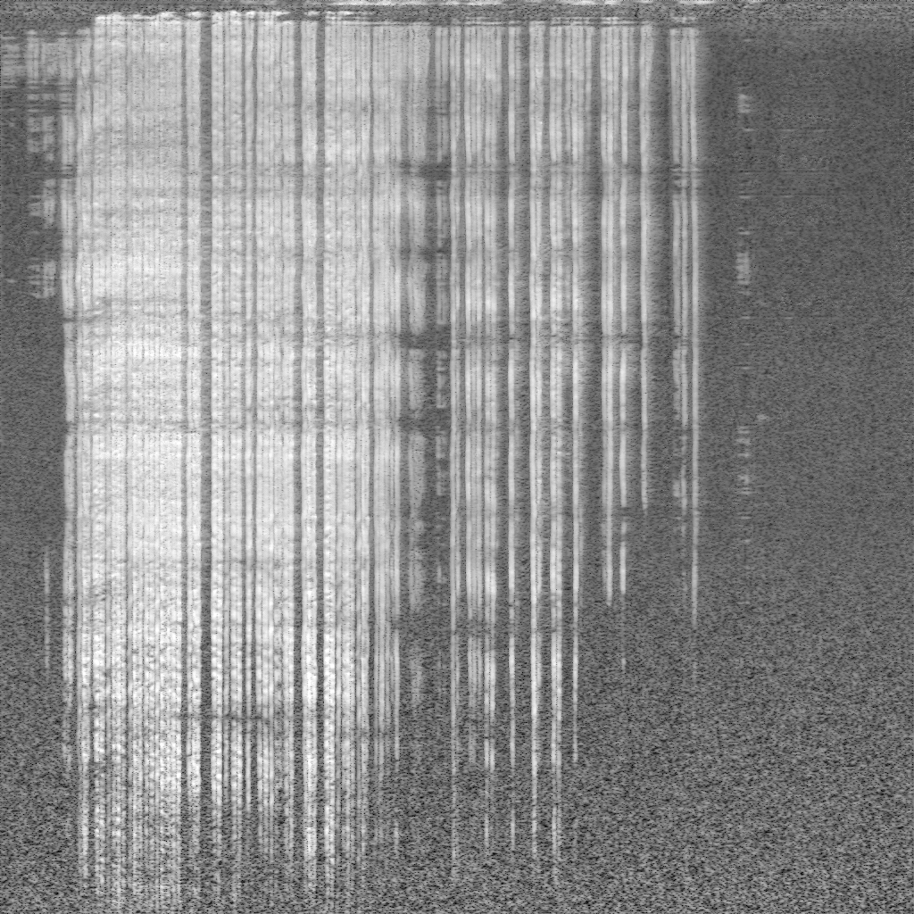
    <em>Reconstructed Audio</em>
    <audio src="resources/stylegan_no_correction/seed3312.wav" controls></audio>
    <em>RAVE-Corrected Audio</em>
    <audio src="resources/stylegan_rave/seed3312.wav" controls></audio>
  

  

    <strong>Example 2</strong>
    <em>Generated Spectrogram</em>
    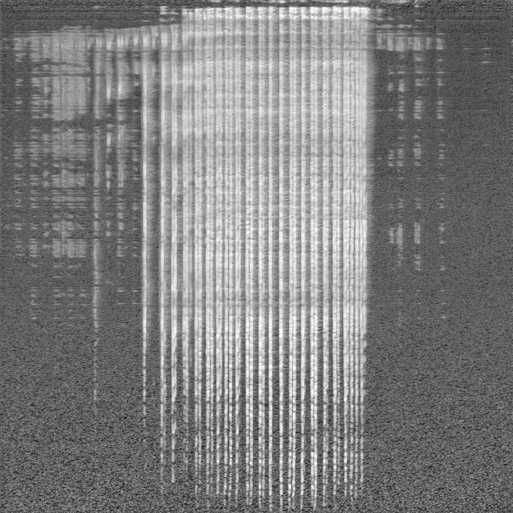
    <em>Reconstructed Audio</em>
    <audio src="resources/stylegan_no_correction/seed3313.wav" controls></audio>
    <em>RAVE-Corrected Audio</em>
    <audio src="resources/stylegan_rave/seed3313.wav" controls></audio>
  

  

    <strong>Example 3</strong>
    <em>Generated Spectrogram</em>
    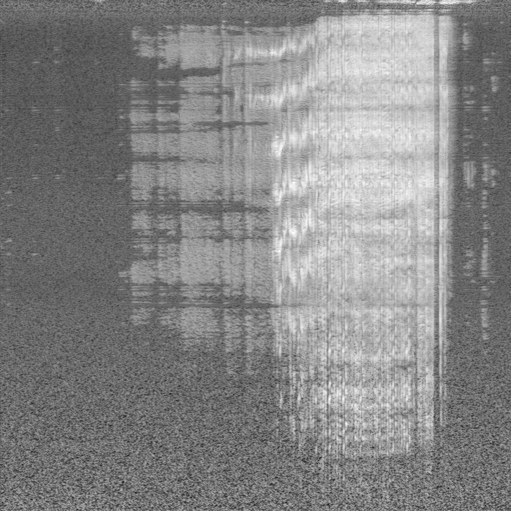
    <em>Reconstructed Audio</em>
    <audio src="resources/stylegan_no_correction/seed3325.wav" controls></audio>
    <em>RAVE-Corrected Audio</em>
    <audio src="resources/stylegan_rave/seed3325.wav" controls></audio>
  

  

    <strong>Example 4</strong>
    <em>Generated Spectrogram</em>
    
    <em>Reconstructed Audio</em>
    <audio src="resources/stylegan_no_correction/seed3358.wav" controls></audio>
    <em>RAVE-Corrected Audio</em>
    <audio src="resources/stylegan_rave/seed3358.wav" controls></audio>
  

  

    <strong>Example 5</strong>
    <em>Generated Spectrogram</em>
    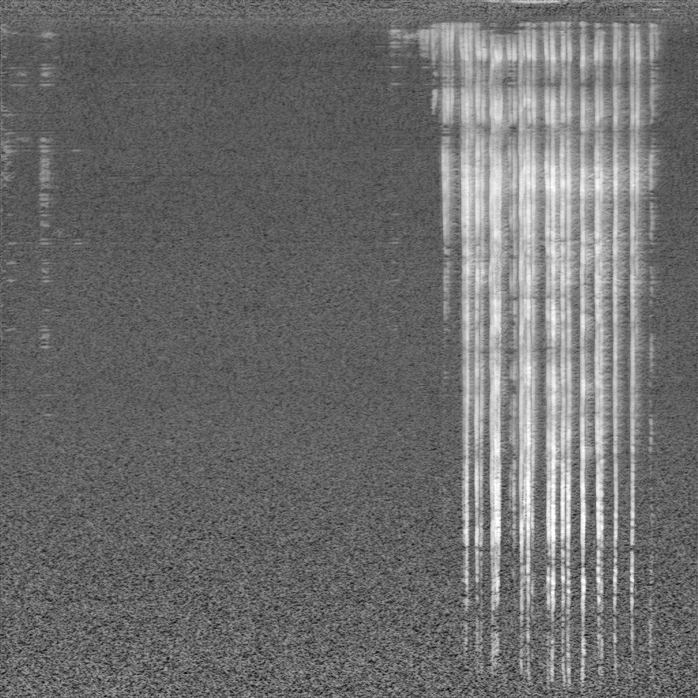
    <em>Reconstructed Audio</em>
    <audio src="resources/stylegan_no_correction/seed3360.wav" controls></audio>
    <em>RAVE-Corrected Audio</em>
    <audio src="resources/stylegan_rave/seed3360.wav" controls></audio>
  

  

    <strong>Example 6</strong>
    <em>Generated Spectrogram</em>
    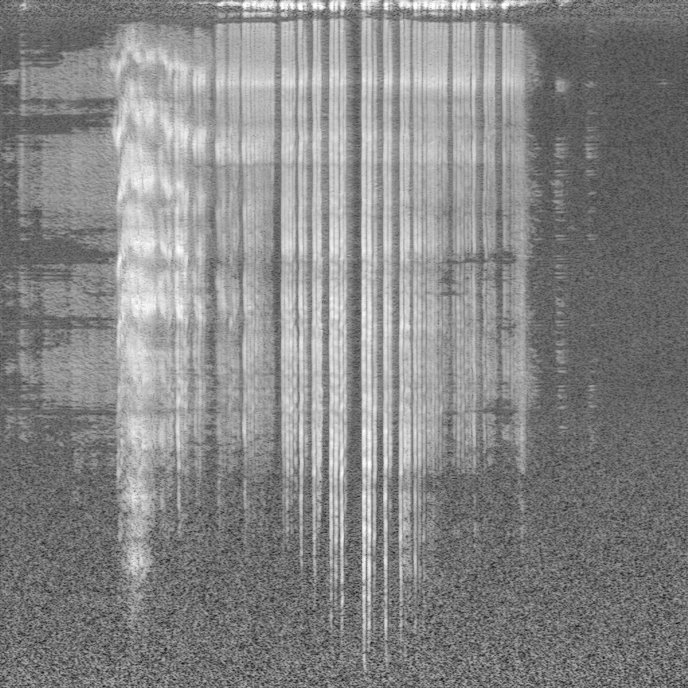
    <em>Reconstructed Audio</em>
    <audio src="resources/stylegan_no_correction/seed14312.wav" controls></audio>
    <em>RAVE-Corrected Audio</em>
    <audio src="resources/stylegan_rave/seed14312.wav" controls></audio>
  

---

### 4.2 StyleGAN2 Latent Space Interpolation

  

    <video src="resources/stylegan_extended_video/sarir_stylegan2_interpolation.mp4" width="500" controls></video>
  

---

### 4.3 Generated Samples Based on Latent Space Interpolation Using Concatenative algorithm

  

    <strong>Example 1</strong>
    <audio src="resources/stylegan_extended/example_1.wav" controls></audio>
    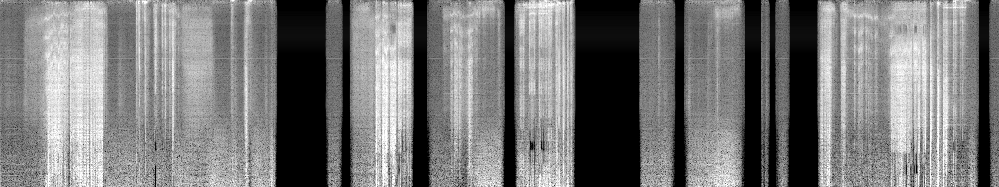
  

  

    <strong>Example 2</strong>
    <audio src="resources/stylegan_extended/example_2.wav" controls></audio>
    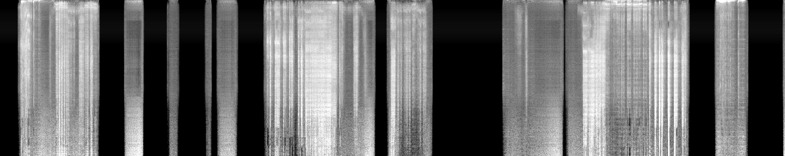
  

  

    <strong>Example 3</strong>
    <audio src="resources/stylegan_extended/example_3.wav" controls></audio>
    
  

  

    <strong>Example 4</strong>
    <audio src="resources/stylegan_extended/example_4.wav" controls></audio>
    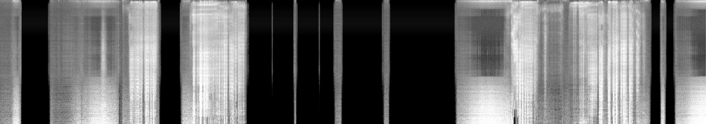
  

  

    <strong>Example 5</strong>
    <audio src="resources/stylegan_extended/example_5.wav" controls></audio>
    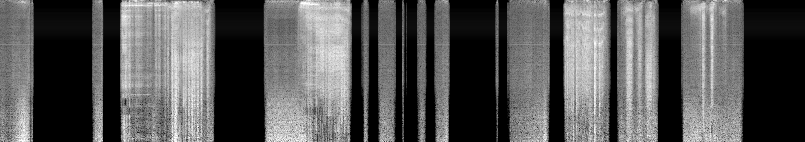
  

---

## 5. Artistic Integration

  

    <video src="resources/artistic sketches/sarir-audiovisual-composition-2-complete.mp4" width="600" controls></video>
  

